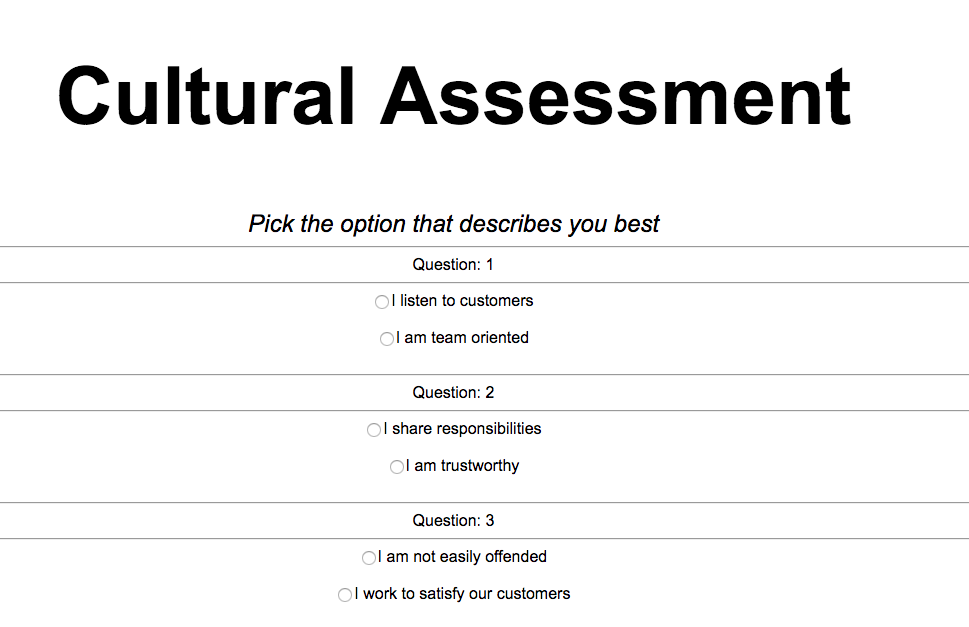
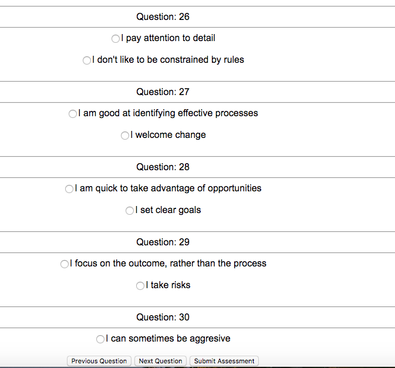

# Culture Assessment App

## Requirements

1. The assessment consists of 30 questions in total.
2. Each question should give the user the option to choose between two dimensions.
3. Dimension should be matched exactly two times. For example, the user must choose
between options related to Adaptability and Collaboration twice.
4. Each time a user chooses an answer, his score for the corresponding dimension is
incremented by 1.
5. The result of the assessment is represented by the amount of times each dimension was
chosen. Here is a JSON representation:

```
		dimensions:	{
				Adaptive:	4,
				Integrity:	7,
				Collaborative:	5,
				Result:	3,
				Customer:	4,
				Detail:	5
		}
```    

## Installation

**Make sure you have [Node](https://nodejs.org/en/) installed**

**Clone this repository**
```
$ git clone https://github.com/exchai93/culture_assessment.git
$ cd culture_assessment
```

**Install dependencies**
```
$ npm install
```

**Run application**
- Locally: copy the full path of `quiz.html`

- Yet to zip build folder to host on AWS site


**To run tests**(Currentl N/A)
```
$ npm test
```


<p>


## My approach

This is by no means finished. I decided to tackle this project by implementing a simple front-end solution. The 30 randomised questions currently render on one single page and you can select one option for each question.

I used webpack to compile my files and hosted the single page app on AWS.

**Issues**
- Need to be able to 'submit' the questions to then calculate the score on a new page
- To calculate the score I will need to `querySelectorAll` the dimension categories that have been selected and print out the numerical values

**To refactor:**
- To render all the questions to the DOM at the the end rather than intermittently throughout my code.

**Testing:** To use Mocha testing framework and Chai assertion library for expectations. This would allow to make write simple unit tests for the front-end.

## Future improvements

- Use an API for the heavy business logic - using tool such as json-server. With the dimensions.json file I would be able to mock RESTFUL routes.
- Put each question on a new page, with a `next question` button
- Use JQuery to add flow between pages
- Progressive web app design

- Start entirely again and work on an MVC server side project using Rails. I would generate a questions controller that would have RESTFUL routes i.e. `question/dimension` `question/:id`. To create the questions I would create a seed database with the dimension statements. Enabling user sign up / log in would be straight forward, using `omniauth`.

## Technologies
- Javascript
(For future improvements)
- Jquery
- Mocha and Chai

## User Stories MVP
```
As a user
So that I can complete the assessment
I want to answer 30 questions in total
```
```
As a user
So that I can answer a question
I want to be presented with two statements from differing dimensions to choose from
```
```
As a user
So that I can finish the assessment
I want to be able to click a 'submit' button
```
```
As a user
So that I can view my score after finishing the assessment
I want to see the dimensions with their numerical value.
```

## User Stories - Nice to have
```
As a user
So that I can keep track of my score
I want to be able to sign up and log in
```
```
As a user
So that I am not overloaded with questions
I want one question to appear on a page
```
```
As a user
So that I can move onto the next question
I want to click 'next question'
```
